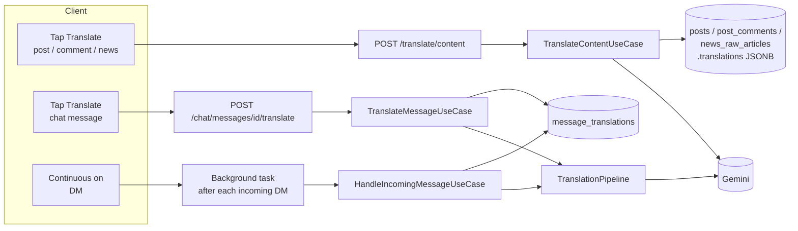
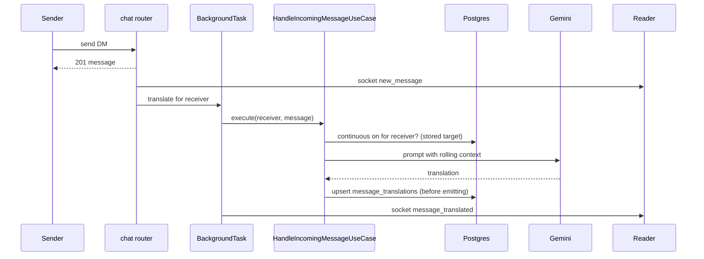
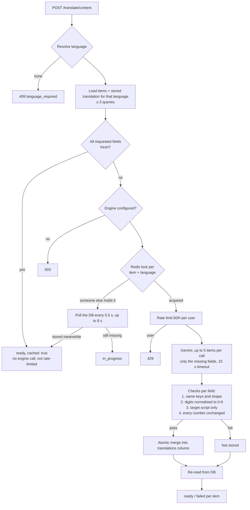

# Translation Module — How It Works

How translation works across the app: where it is offered, what happens on each request, and how each kind of translation is **stored** and **read back**.

- **API shapes, error codes, frontend flows:** [translation_api_contract.md](translation_api_contract.md)
- **Line-by-line walkthrough of the chat code:** [translation_module_architecture.md](translation_module_architecture.md)

---

## 1. Where translation is offered

| Surface | How it is triggered | Endpoint | Stored in | Read back through |
|---|---|---|---|---|
| **Chat, single message** (DM or group) | User taps Translate on a received message | `POST /chat/messages/{id}/translate` | `message_translations` table | The same endpoint; the DM message list if continuous is on |
| **Chat, continuous** (DM only) | User switches it on for a DM; every incoming message is translated | `POST /chat/conversations/{id}/continuous-translation` | `message_translations` table | `GET /chat/conversations/{id}/messages`, socket `message_translated` |
| **Posts** | User taps Translate | `POST /translate/content` | `posts.translations` (JSONB column) | The same endpoint |
| **Comments** | User taps Translate (usually with the post) | `POST /translate/content` | `post_comments.translations` | The same endpoint |
| **News** | User taps Translate on a card or the detail screen | `POST /translate/content` | `news_raw_articles.translations` | The same endpoint |

**Common rules:**
- **Nothing is translated automatically.** The one exception is continuous chat, which the user switches on.
- **Feeds and lists always return the original text.** Translations are shown next to it.
- **One engine:** Gemini (`TRANSLATION_GEMINI_MODEL`, currently `gemini-flash-lite-latest`) behind one adapter, `GeminiTranslationEngine`, used by both chat and content.
- **Stored once, shared by everyone.** A translation is stored per *(item, language)*, not per user. The second reader of the same thing in the same language gets it from the database at no cost.



---

## 2. Choosing the target language

Settings live in two tables, both keyed by `users.id` and deleted with the user:

| Table | Holds | Written by |
|---|---|---|
| `reader_translation_defaults` | The user's app-wide translation language | `PUT /translate/preference` |
| `reader_conversation_translation_prefs` | Per DM: target language + continuous on/off | `POST /chat/conversations/{id}/continuous-translation` |

| Surface | Resolution order (first match wins) | If nothing matches |
|---|---|---|
| Posts, comments, news (`ResolveContentLanguageUseCase`) | body `target_lang` → `X-App-Language` header if not `en` → `reader_translation_defaults` | **409 `language_required`**: the app asks the user |
| Chat single tap (`ResolveTargetLanguageUseCase`) | body `target_lang` → this DM's conversation pref → `reader_translation_defaults` | Automatic: English → Hindi, anything else → English |
| Chat continuous (`ToggleContinuousTranslationUseCase`) | Same as single tap, resolved **once** when switched on and stored on the conversation pref | Stores `null` and falls back to automatic per message |

Language codes are normalised (`hi-IN` → `hi`). Anything outside the 11 supported codes is ignored rather than sent to the engine.

---

## 3. Chat translation

### 3.1 Storage

| Table | Key | Columns | Lifetime |
|---|---|---|---|
| `message_translations` | `(message_id, target_lang)` | `translated_text`, `created_at` | FK to `messages` with `ON DELETE CASCADE`. Chat deletes are *soft* (`is_deleted`), so rows stay but are never served for a deleted message. |
| `conversation_translation_context` | `(context_type, context_id)` | `summary`, `last_summarized_message_id`, `messages_since_refresh`, `updated_at` | One rolling summary per DM or group, shared by all its readers |
| In-process LRU (`InMemoryTranslationCache`) | hash of (language, context summary, text) | translated text | Up to 2,000 entries per process; gone on restart |

**Why the rolling summary exists:** chat messages are short and full of references ("kal wala rate", "same as before"). The summary gives the engine enough context to translate them correctly. It is refreshed **inside the same engine call** every 20 translate requests or every 24 h (`TRANSLATION_SUMMARY_REFRESH_EVERY_N_MESSAGES`, `TRANSLATION_SUMMARY_REFRESH_TTL_HOURS`). Once a summary exists, the 2 preceding messages are also sent as context.

### 3.2 Single tap — `POST /chat/messages/{id}/translate`

```mermaid
sequenceDiagram
    participant App
    participant API as chat router
    participant UC as TranslateMessageUseCase
    participant DB as Postgres
    participant LRU as in-process cache
    participant G as Gemini
    App->>API: POST /chat/messages/{id}/translate
    API->>UC: execute(reader, message, target?)
    UC->>DB: load message; reader is a member?
    Note over UC: 403 if not a member, before any cost
    UC->>DB: resolve target language
    UC->>DB: rolling summary (+1 to refresh counter)
    UC->>LRU: text + language + summary?
    alt cache hit
        LRU-->>UC: translation
    else miss
        UC->>API: rate limit 60/h (Redis), only now
        UC->>DB: 2 preceding messages (if summary exists)
        UC->>G: layered prompt
        G-->>UC: translation (+ new summary if due)
        UC->>DB: save summary if refreshed
        UC->>LRU: store
        UC->>DB: upsert message_translations
    end
    UC-->>App: translated_text, target_lang, used_cache
```

**Retrieval:** the endpoint itself (the LRU catches quick repeats). In a DM with continuous on, the stored row is also returned inline on the message list (§3.4). For **groups**, the app keeps the result client-side, because group message lists never carry translations.

### 3.3 Continuous (DM only)



- The translation is **saved before the socket event** is sent. If the reader is offline or the socket drops, the stored row is the only copy, and it is served on the next message fetch.
- **Recovery job** (`translation.retry`, every 5 min): background tasks die with the process on a deploy or crash. The job finds DM messages from the last 60 minutes that a continuous reader should have but has no stored translation for, and re-runs up to 50 per run. It re-checks that continuous is still on first.

### 3.4 Reading chat translations back

`GET /chat/conversations/{id}/messages`:

1. `reader_continuous_target(user, conv)` reads the reader's conversation pref (one row). Continuous off → no translation lookup at all.
2. Otherwise **one query for the whole page**: `message_translations WHERE message_id IN (page) AND target_lang = <target>`.
3. Each message gets `translated_text` / `target_lang`, or `null` where nothing is stored yet.

---

## 4. Posts, comments and news

All three share one path: `POST /translate/content` → `TranslateContentUseCase` → `ContentTranslationRepository`.

### 4.1 Storage — a column on the item itself

| Table | Column | Translatable fields |
|---|---|---|
| `posts` | `translations` | `title`, `caption` |
| `post_comments` | `translations` | `content` |
| `news_raw_articles` | `translations` | `title`, `description` (from the raw row); `summary_bullets`, `impact_factor`, `impact_explanation` (from `news_enriched_articles`) |

Column type is nullable **JSONB**, added by migration `c7d2e9f4a1b3`. Shape:

```json
{
  "hi": {
    "title":   { "h": "3f9a1c0b2d4e5f60", "v": "अंकुल ट्रेडर्स - शरबती गेहूं उपलब्ध" },
    "caption": { "h": "a81c77e09b3d2f14", "v": "इंदौर मंडी से 50 MT शरबती गेहूं रेडी है…" }
  },
  "mr": {
    "title":   { "h": "3f9a1c0b2d4e5f60", "v": "अंकुल ट्रेडर्स - शरबती गहू उपलब्ध" }
  }
}
```

- `h` is a 16-character SHA-256 prefix of the **source text** the translation was made from. `v` is the translation. `summary_bullets` stores a list in `v`.
- News translations sit on `news_raw_articles` because that row is the article's identity (`article_id` everywhere in the API). They cover the enrichment fields too.

**Design choices and why**

| Choice | Why |
|---|---|
| Stored on the item, not a separate table | Deleting the item deletes its translations with no cleanup job. Posts are hard-deleted, and comments cascade with their post. News is archived (`is_active = false`) and never deleted, so its translations stay with it. |
| Column is `deferred` in the ORM | Feeds and every other read of the row never load it. Feed payloads and query costs are unchanged. |
| Per-field source hash | An edited post or regenerated news summary no longer matches its hash, so only that field is translated again on the next tap. The post and news modules need no invalidation hook. |
| Only the translation module writes the column | The owning modules never touch it. |

### 4.2 Writing — one atomic statement

```sql
UPDATE posts
   SET translations = COALESCE(translations, '{}'::jsonb)
       || jsonb_build_object(:lang,
            COALESCE(translations -> :lang, '{}'::jsonb) || CAST(:fields AS jsonb))
 WHERE id = :id
```

- Merges the new fields into that one language and keeps every other language and field.
- **Touches only this column in one statement.** A like or comment-count update landing at the same moment can't be undone, and neither can another language being saved. Postgres re-evaluates the expression on the latest row version.
- The table name comes from a fixed map (`post` → `posts`, …), never from input.

### 4.3 Reading — only the requested language

One query per content type in the request (at most 3), and each selects **only** `translations -> '<lang>'`, never the whole column:

| Type | Query |
|---|---|
| post | `posts` + LEFT JOIN `post_deal_details` (the deal becomes engine context: commodity, quantity, price) |
| comment | `post_comments` + JOIN `posts` (the post title becomes context) |
| news | `news_raw_articles` + LEFT JOIN `news_enriched_articles` (source name becomes context) |

For each requested field (`split_fresh`):
- the stored `h` equals the hash of today's source → **ready**, returned as-is;
- otherwise → still needs translating.

### 4.4 The full request flow



**The checks, and why each exists** (all seen failing on real Gemini output during testing):

| Check | Rejects |
|---|---|
| Shape | Missing or extra fields; news bullets merged or split |
| Script | Letters from another alphabet, e.g. Cyrillic inside Hindi ("शरбаты"), or Hindi letters in a Gujarati translation; text that is still over 40% Latin (fields of 12+ letters only, so codes like "MSP" pass) |
| Numbers | Any price, quantity or date that changed or disappeared. Indian-script digits are first converted to 0-9, so "₹८,४५०" is stored as "₹8,450". |

Checks apply **per field**. A rejected field is not stored, the good ones are. The item reports `failed` and the next tap retries only the missing field. Bad output is never stored, so it can never be served to later readers.

### 4.5 Cost behaviour

- **One engine call per item, per language, per version of the text.** Every later reader of that language gets the stored copy.
- News benefits most: everyone sees the same articles, and most are English.
- A news card asks only for `title` and `summary_bullets`. Opening the detail later pays only for the remaining fields.
- Only requests that reach the engine count toward the rate limit.

---

## 5. Side-by-side

| | Chat single tap | Chat continuous | Posts / comments / news |
|---|---|---|---|
| Trigger | Tap | Incoming DM (after opt-in) | Tap |
| Runs | In the request | Background task + 5-min recovery job | In the request |
| Context sent to engine | Rolling conversation summary + 2 previous messages | Same | Deal details / post title / news source |
| Storage | `message_translations` row per (message, language) | Same | `translations` JSONB on the item, per language, per field |
| Freshness | Messages can't be edited; stored once | Same | Per-field source hash; edits re-translate |
| Retrieval | Endpoint (+ LRU); DM list if continuous on | Message list (1 query per page) + socket push | Endpoint only (1 query per content type) |
| Duplicate protection | In-process LRU + DB upsert | DB upsert | Redis lock per (item, language) + DB |
| Output checks | Script, numbers; one retry, then 502 | Script, numbers; one retry, then left untranslated (skipped for 2 h) | Shape, script, numbers; one retry alone |
| Rate limit | 60 / user / hour, engine calls only | None (driven by incoming messages) | 60 / user / hour, engine calls only |
| Deleted with | Message (hard delete; soft-deleted messages are just never served) | Same | The item's row |

---

## 6. Where the code lives

| Piece | File |
|---|---|
| Content: domain rules (hashing, freshness, shape / script / number checks) | `app/modules/translation/domain/content.py` |
| Content prompt | `app/modules/translation/domain/content_prompt.py` |
| Chat prompt + language list | `app/modules/translation/domain/prompt.py` |
| Content use case | `app/modules/translation/application/use_cases/translate_content.py` |
| Language resolution (content) / preference | `…/use_cases/resolve_content_language.py`, `…/use_cases/translation_preference.py` |
| Chat use cases | `…/use_cases/translate_message.py`, `handle_incoming_message.py`, `toggle_continuous.py`, `resolve_target_language.py` |
| Chat pipeline (context + summary refresh) | `app/modules/translation/application/pipeline.py` |
| Content storage | `app/modules/translation/data/content_repository.py` |
| Chat storage, prefs, rolling context | `app/modules/translation/data/repository.py`, `data/models.py` |
| Gemini adapter (both) | `app/modules/translation/data/adapters/gemini_engine.py` |
| Redis lock | `app/modules/translation/data/adapters/redis_lock.py` |
| Content + preference endpoints | `app/modules/translation/presentation/router.py` |
| Chat endpoints, background task, readback | `app/modules/chat/presentation/router.py`, `chat/data/repository.py` (`get_messages`, `reader_continuous_target`) |
| Recovery job | `app/modules/translation/application/jobs.py`, scheduled in `app/core/scheduler.py` |
| Limits and timings | `app/modules/translation/domain/value_objects.py` |
| Tests | `tests/test_translation.py` (chat), `tests/test_content_translation.py` (content) |

---

## 7. Known gaps

- **Gujarati:** the current model often fails the script check on Hinglish posts, so those translations come back `failed` rather than wrong. A comparison with a larger model is pending.
- **Names outside post text are not transliterated:** author, business and group names in feeds. Planned as a separate feature.
- Group deals and personal deals are not translatable yet.
- Continuous translation does not exist for groups.
